# Mini Market Sales & Order Management System

Full stack mobile market sales and order management system built with **ASP.NET Core Web API** and **.NET MAUI**.

The project includes authentication, product management, shopping cart, order processing, address management and user profile features.

---

## Technologies

- ASP.NET Core Web API
- .NET MAUI
- SQL Server
- Entity Framework Core
- JWT Authentication
- REST API

---

## Features

- 🔐 User authentication (JWT)
- 📦 Product and category listing
- 🛒 Shopping cart management
- 📑 Order creation and tracking
- 📍 Address management
- 👤 Profile management
- 🔎 Search functionality
- 🎁 Gift card support
---

# Application Screenshots

## Home Page

  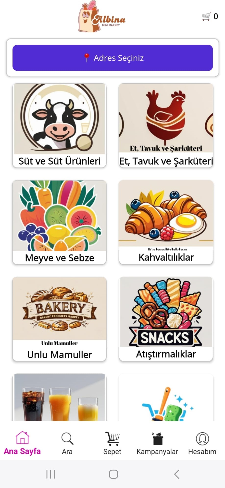

The home page displays product categories and allows users to select a delivery address.

---

## Category Listing

  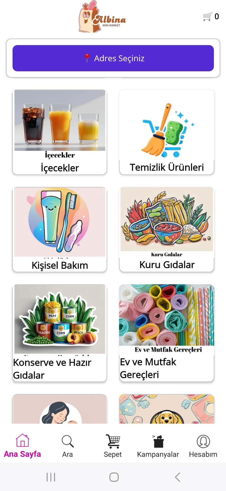

Users can browse different product categories.

---

## Authentication (Login & Registration)

  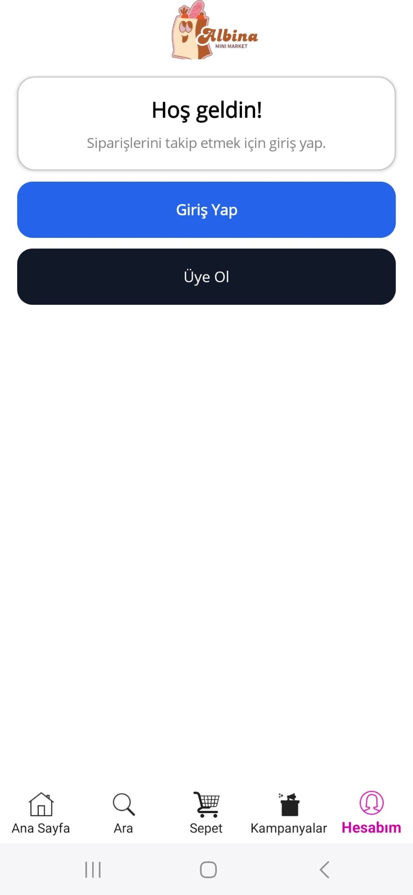
  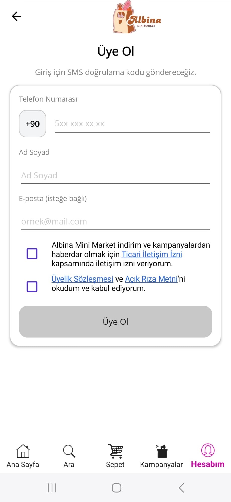
  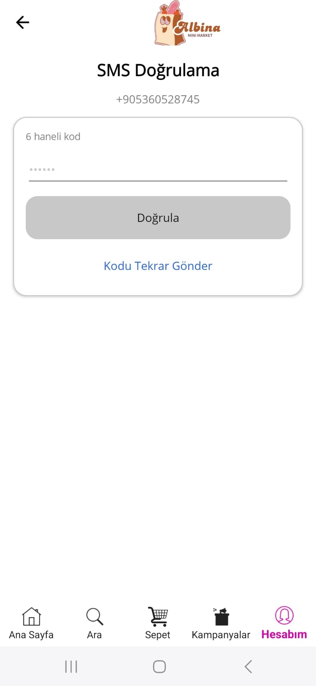

Users must log in before selecting an address or placing an order.

---

## Search Page

  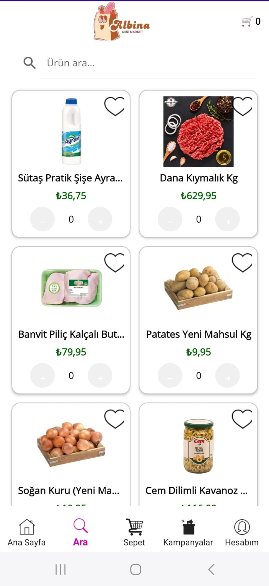
   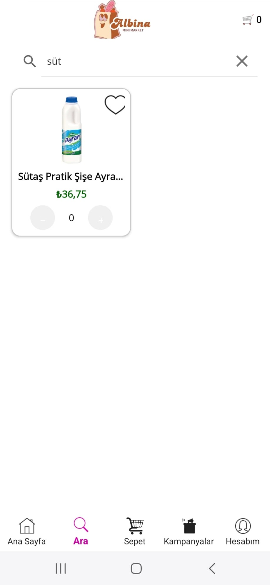

Users can search for products quickly using the search functionality.

---

## Cart Page

  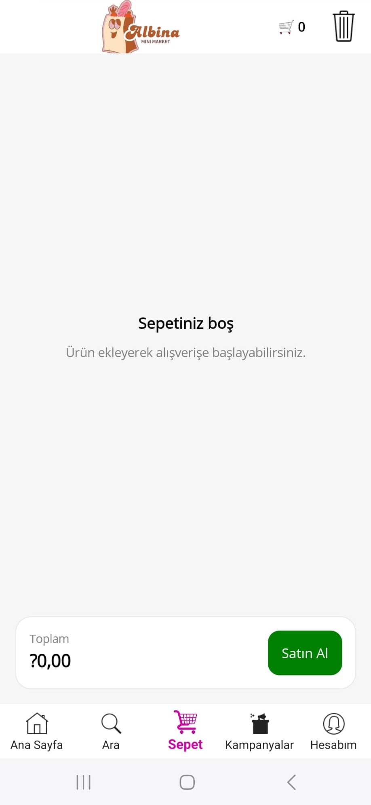
   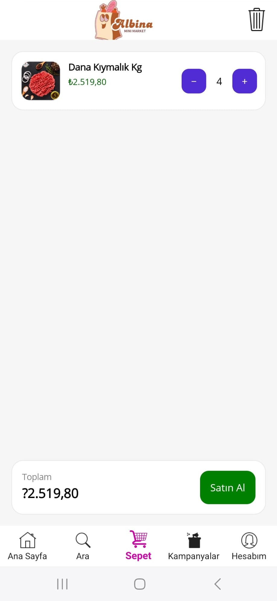

Products can be added or removed from the cart.

---

## Address Management

  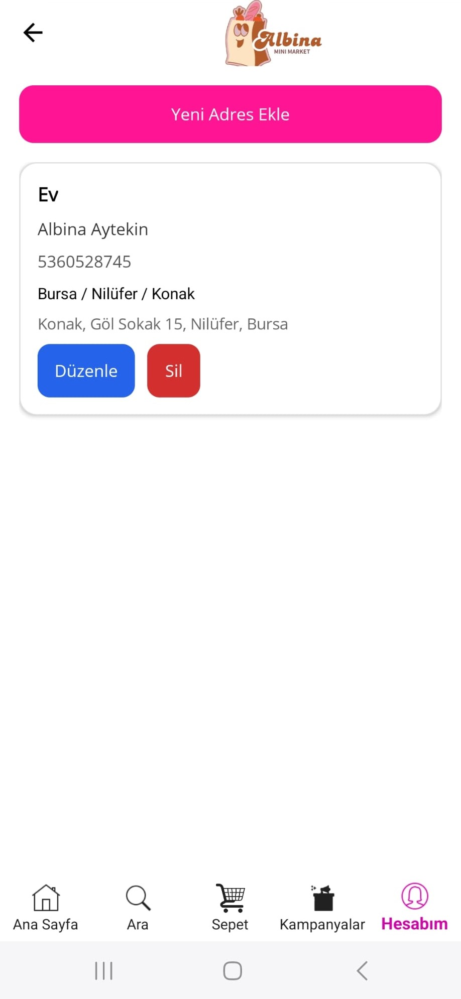

Users can manage their delivery addresses.

---

## Map Address Selection

  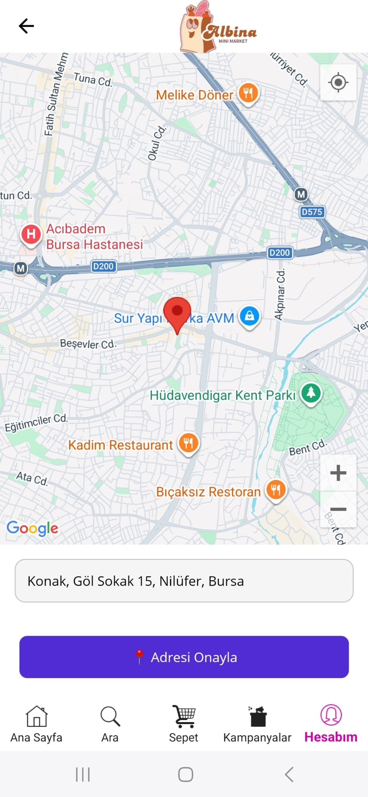

Users can select their location using the map.

---

## Order Page

  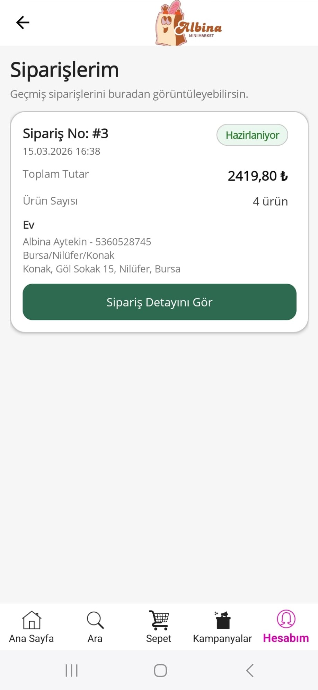
   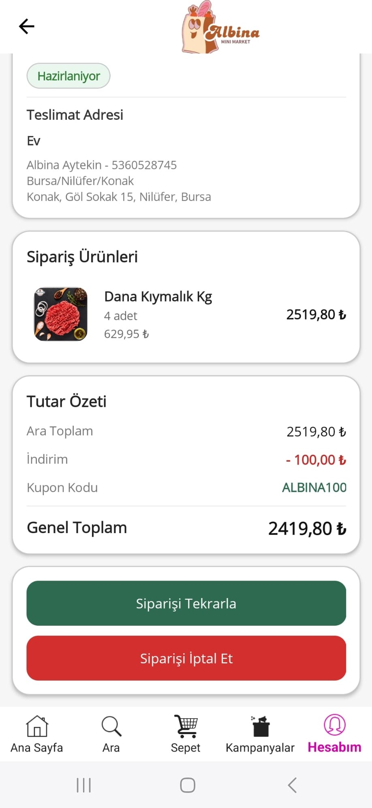

Users can review and create orders.

---

## Payment Page

  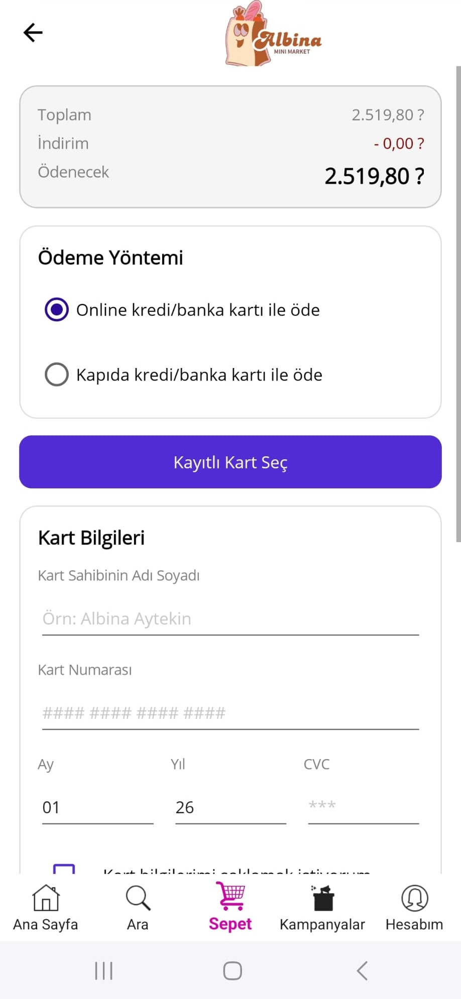
   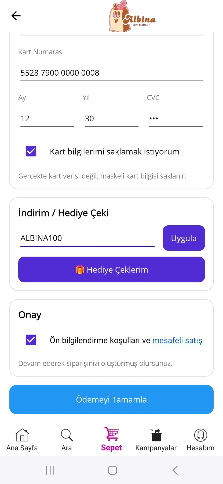

Users can select their preferred payment method.

---

## Profile Page

  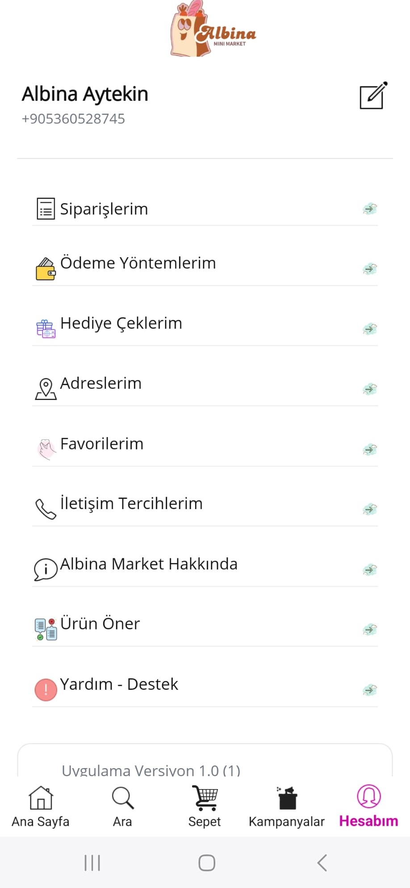
   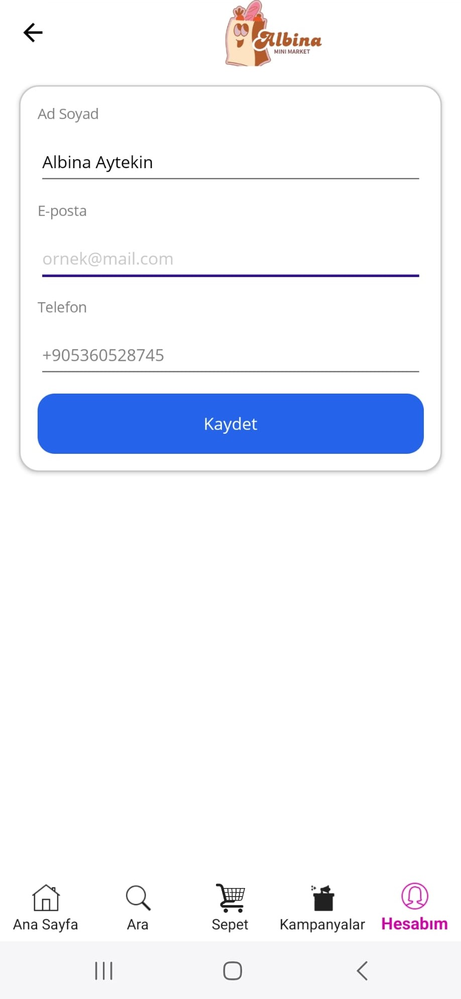

Users can view and edit their profile information.

---

## API Documentation (Swagger UI)

  

Swagger UI is used to explore and test the REST API endpoints of the system.

# API Architecture

The backend is built with ASP.NET Core Web API and follows a layered architecture:

- **Controllers** handle HTTP requests.
- **Services** contain business logic.
- **DTOs** are used for API data transfer.
- **Entities** represent database models.
- **Entity Framework Core** handles database operations.
---

# Database

SQL Server is used as the database.

The project uses **Entity Framework Core with Code First approach** for database migrations and schema management.

---

# Authentication

JWT based authentication is implemented for secure API access.

Users authenticate using **SMS verification (OTP)** and receive a **JWT token** for authorized API requests.

---

# Future Improvements

- Push notifications
- Real payment gateway integration
- Admin panel improvements
- Product image optimization
- Performance improvements

## 
The source code is currently kept private.
It can be shared upon request for review.
